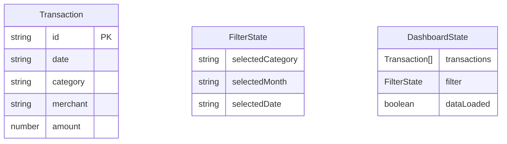

## 1. 架构设计

```mermaid
flowchart TB
    "Frontend[前端 React 应用]" --> "CSVParser[CSV 解析模块]"
    "Frontend" --> "Store[Zustand 状态管理]"
    "Store" --> "LocalStorage[localStorage 持久化]"
    "Frontend" --> "Charts[图表组件层]"
    "Charts" --> "LineChart[折线图 - ECharts]"
    "Charts" --> "PieChart[环形图 - ECharts]"
    "Charts" --> "Heatmap[热力日历 - 自定义 SVG]"
    "Frontend" --> "Table[明细表组件]"
    "Store" --> "Filter[联动筛选逻辑]"
    "Filter" --> "LineChart"
    "Filter" --> "PieChart"
    "Filter" --> "Heatmap"
    "Filter" --> "Table"
```

## 2. 技术说明

- 前端：React@18 + TypeScript + Tailwind CSS@3 + Vite
- 状态管理：Zustand@5
- 图表库：ECharts（通过 echarts-for-react 封装）
- CSV 解析：papaparse
- 数据持久化：localStorage
- 后端：无
- 数据库：无（纯前端本地存储）

## 3. 路由定义

| 路由 | 用途 |
|------|------|
| / | 仪表盘主页面，包含所有图表与交互 |

## 4. API 定义

无后端 API，所有数据在浏览器本地处理。

## 5. 服务端架构图

不适用

## 6. 数据模型

### 6.1 数据模型定义



### 6.2 数据定义

CSV 文件预期格式：

| 列名 | 类型 | 说明 | 示例 |
|------|------|------|------|
| date | string | 交易日期 | 2025-03-15 |
| category | string | 消费分类 | 餐饮 |
| merchant | string | 商户名称 | 星巴克 |
| amount | number | 消费金额（正数） | 38.00 |

CSV 解析时自动适配以下列名映射：
- 日期：date / 日期 / 交易日期
- 分类：category / 分类 / 消费分类
- 商户：merchant / 商户 / 交易对方
- 金额：amount / 金额 / 交易金额

localStorage 存储键：
- `spendlens_transactions`：序列化的 Transaction 数组
